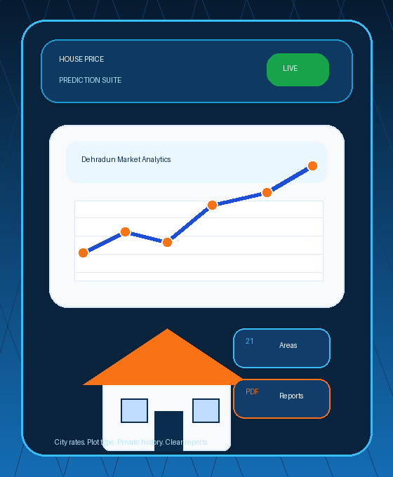

# House Price Prediction System

A modern Python desktop application for predicting house prices based on area, rooms, bathrooms, floors, age, plot type, and Dehradun city/location market rates.

## Features

- User login and signup system
- Forgot password and profile update options
- House price prediction using market-rate logic and ML model support
- Residential and Industrial plot type prediction
- City-wise price rate table for Dehradun locations
- Prediction history for each user
- Search and filter history by city, plot type, and price range
- Graphical price analysis using Matplotlib
- Save property prediction reports
- Light and dark mode support
- Custom dashboard and login artwork
- PyInstaller spec file included for building an executable

### Login / Dashboard Artwork


### Dashboard Preview


## Tech Stack

- Python
- CustomTkinter
- Tkinter
- Matplotlib
- Pillow
- Pickle
- PyInstaller

## Project Files

```text
main.py                 Main application file
main.spec               PyInstaller build configuration
model.pkl               Trained/serialized ML model
model_ml.pkl            Lightweight ML model data
dashboard_auto.png      Dashboard image asset
login_property_art.png  Login screen image asset
